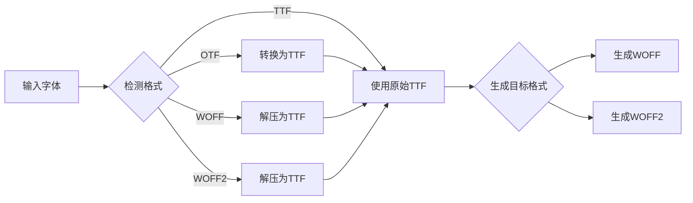
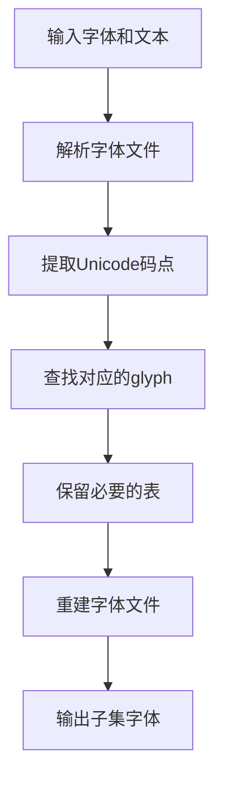

# unplugin-webfont 架构设计文档

## 📋 项目概述

**unplugin-webfont** 是一个强大的字体转换工具，支持将多种格式的字体文件转换为 Web 可用的格式，并支持文本子集化功能以优化字体文件大小。

### 核心特性
- ✅ 支持多种输入格式：TTF、OTF、WOFF、WOFF2
- ✅ 输出现代 Web 格式：WOFF2、WOFF
- ✅ 文本子集化：只打包需要的文字
- ✅ unplugin 插件：支持 Vite、Webpack、Rollup 等
- ✅ CLI 工具：命令行快速转换
- ✅ Web UI：可视化操作界面

---

## 🏗️ 项目结构

```
unplugin-webfont/
├── src/
│   ├── core/              # 核心转换引擎
│   │   ├── converter.ts   # 字体格式转换
│   │   ├── subsetter.ts   # 文本子集化
│   │   ├── detector.ts    # 格式检测
│   │   └── generator.ts   # CSS生成器
│   ├── unplugin/          # unplugin插件
│   │   ├── index.ts       # 插件入口
│   │   ├── options.ts     # 配置类型定义
│   │   └── utils.ts       # 工具函数
│   ├── cli/               # CLI工具
│   │   ├── index.ts       # CLI入口
│   │   ├── commands.ts    # 命令定义
│   │   └── prompts.ts     # 交互式问答
│   ├── ui/                # Web界面
│   │   ├── index.html     # HTML入口
│   │   ├── App.vue        # 主组件
│   │   ├── components/    # UI组件
│   │   └── worker/        # Web Worker
│   └── types/             # 类型定义
├── test/                  # 测试文件
├── examples/              # 使用示例
├── package.json
├── tsconfig.json
└── README.md
```

---

## 🔧 技术栈

### 核心依赖
- **fontkit**: 字体文件解析和操作
- **opentype.js**: OpenType字体处理
- **fontmin**: 文本子集化（基于harfbuzz）
- **wawoff2**: WOFF2压缩/解压
- **pako**: WOFF压缩/解压（zlib）

### 插件框架
- **unplugin**: 统一的插件接口，支持多种构建工具

### CLI工具
- **commander**: 命令行参数解析
- **inquirer**: 交互式问答
- **chalk**: 彩色输出
- **ora**: 加载动画

### Web UI
- **Vue 3**: 前端框架
- **Vite**: 开发和构建工具
- **Element Plus**: UI组件库
- **JSZip**: 文件打包下载

---

## 🎯 核心模块设计

### 1. 格式检测器 (detector.ts)

```typescript
interface FontInfo {
  format: 'ttf' | 'otf' | 'woff' | 'woff2' | 'unknown'
  family: string
  style: string
  weight: number
  glyphCount: number
}

export async function detectFontFormat(buffer: Buffer): Promise<FontInfo>
```

**功能**：
- 通过文件头魔数检测字体格式
- 解析字体元信息
- 返回详细的字体信息

**魔数对照表**：
- TTF: `0x00010000`
- OTF: `OTTO`
- WOFF: `wOFF`
- WOFF2: `wOF2`

---

### 2. 格式转换器 (converter.ts)

```typescript
interface ConvertOptions {
  inputBuffer: Buffer
  inputFormat: string
  outputFormats: ('woff' | 'woff2' | 'ttf')[]
}

interface ConvertResult {
  format: string
  buffer: Buffer
  size: number
}

export async function convertFont(options: ConvertOptions): Promise<ConvertResult[]>
```

**转换流程**：



**转换策略**：
1. 所有格式先统一转换为 TTF（中间格式）
2. 从 TTF 生成目标格式（WOFF、WOFF2）

---

### 3. 文本子集化器 (subsetter.ts)

```typescript
interface SubsetOptions {
  fontBuffer: Buffer
  text: string          // 要包含的文字
  hinting?: boolean     // 是否保留hinting
}

export async function subsetFont(options: SubsetOptions): Promise<Buffer>
```

**子集化流程**：



**保留的字体表**：
- `cmap`: 字符到glyph的映射
- `glyf`: glyph数据
- `head`: 字体头信息
- `hhea`: 水平度量头
- `hmtx`: 水平度量表
- `maxp`: 最大值表
- `name`: 名称表
- `post`: PostScript信息

---

### 4. CSS生成器 (generator.ts)

```typescript
interface CSSOptions {
  fontFamily: string
  fontFiles: Array<{
    format: string
    path: string
  }>
  fontWeight?: number
  fontStyle?: string
}

export function generateCSS(options: CSSOptions): string
```

**生成的CSS格式**：
```css
@font-face {
  font-family: 'CustomFont';
  src: url('./font.woff2') format('woff2'),
       url('./font.woff') format('woff');
  font-weight: 400;
  font-style: normal;
  font-display: swap;
}
```

---

## 🔌 unplugin 插件设计

### 插件配置接口

```typescript
export interface WebFontPluginOptions {
  // 字体文件路径（支持glob模式）
  include?: string | string[]
  
  // 要包含的文字
  text?: string
  
  // 从文件读取文字
  textFile?: string
  
  // 输出格式
  formats?: ('woff' | 'woff2' | 'ttf')[]
  
  // 输出目录
  outputDir?: string
  
  // 是否生成CSS文件
  cssOutput?: boolean | string
  
  // 字体配置
  fontFamily?: string
  fontWeight?: number
  fontStyle?: string
}
```

### 插件使用示例

**Vite**:
```typescript
// vite.config.ts
import { defineConfig } from 'vite'
import WebFont from 'unplugin-webfont/vite'

export default defineConfig({
  plugins: [
    WebFont({
      include: './fonts/*.ttf',
      text: '你好世界',
      formats: ['woff2', 'woff'],
      outputDir: 'public/fonts',
      cssOutput: true
    })
  ]
})
```

**Webpack**:
```javascript
// webpack.config.js
const WebFont = require('unplugin-webfont/webpack')

module.exports = {
  plugins: [
    WebFont({
      include: './fonts/*.ttf',
      text: '你好世界'
    })
  ]
}
```

---

## 💻 CLI工具设计

### 命令结构

```bash
webfont <command> [options]

Commands:
  convert <input>      转换字体格式
  subset <input>       创建字体子集
  info <input>         查看字体信息
  serve                启动可视化界面

Options:
  -t, --text <text>           要包含的文字
  -f, --text-file <file>      从文件读取文字
  -o, --output <dir>          输出目录
  --formats <formats>         输出格式 (woff,woff2)
  --font-family <name>        字体名称
  -c, --css                   生成CSS文件
  -w, --watch                 监听文件变化
  -h, --help                  显示帮助
```

### CLI使用示例

```bash
# 基础转换
webfont convert input.ttf -o output/

# 创建子集
webfont subset input.ttf -t "你好世界" -o output/

# 从文件读取文字
webfont subset input.ttf -f chars.txt --formats woff2,woff

# 生成CSS
webfont convert input.ttf -o output/ -c --font-family MyFont

# 查看字体信息
webfont info input.ttf

# 启动可视化界面
webfont serve
```

### 交互式模式

```bash
webfont
? 请选择操作: (Use arrow keys)
❯ 转换字体格式
  创建字体子集
  查看字体信息
  启动可视化界面

? 请选择字体文件: ./fonts/SourceHanSans.ttf
? 输入要包含的文字: 你好世界Hello
? 选择输出格式: (Press <space> to select)
❯◉ WOFF2
 ◉ WOFF
 ◯ TTF
? 输出目录: ./output
✔ 转换完成！
```

---

## 🎨 Web UI设计

### 界面布局

```
┌─────────────────────────────────────────┐
│         unplugin-webfont               │
├─────────────────────────────────────────┤
│  ┌──────────────┐  ┌─────────────────┐ │
│  │  上传字体    │  │  配置选项       │ │
│  │  [拖拽区域]  │  │  ☑ WOFF2       │ │
│  │              │  │  ☑ WOFF        │ │
│  │  或点击选择  │  │  字体名称: ___ │ │
│  └──────────────┘  └─────────────────┘ │
│                                         │
│  ┌───────────────────────────────────┐ │
│  │  输入要包含的文字                 │ │
│  │  [文本框]                         │ │
│  │  或 [上传文本文件]                │ │
│  └───────────────────────────────────┘ │
│                                         │
│  ┌───────────────────────────────────┐ │
│  │  字体预览                         │ │
│  │  你好世界 Hello World 123         │ │
│  │  原始大小: 2.5MB                  │ │
│  │  压缩后: 15KB (减少99.4%)         │ │
│  └───────────────────────────────────┘ │
│                                         │
│  [开始转换]  [下载全部]  [清空]       │
└─────────────────────────────────────────┘
```

### 核心组件

**1. FileUpload.vue** - 文件上传组件
- 支持拖拽上传
- 支持多文件选择
- 文件类型验证
- 文件预览

**2. TextInput.vue** - 文本输入组件
- 文本输入框
- 文件导入
- 常用字符集模板

**3. FontPreview.vue** - 字体预览组件
- 实时预览字体效果
- 显示字体信息
- 文件大小对比

**4. ConfigPanel.vue** - 配置面板
- 格式选择
- 字体属性配置
- 高级选项

### Web Worker处理

```typescript
// worker/font-worker.ts
self.onmessage = async (e) => {
  const { type, data } = e.data
  
  switch (type) {
    case 'convert':
      const result = await convertFont(data)
      self.postMessage({ type: 'result', data: result })
      break
    case 'subset':
      const subset = await subsetFont(data)
      self.postMessage({ type: 'result', data: subset })
      break
  }
}
```

**优势**：
- 避免阻塞主线程
- 提升用户体验
- 支持大文件处理

---

## 📦 核心依赖说明

### 1. fontkit
- **用途**: 解析字体文件，获取字体信息
- **功能**: 支持TTF、OTF格式
- **API**: `fontkit.open(buffer)`

### 2. fontmin
- **用途**: 字体子集化
- **功能**: 提取指定字符，生成精简字体
- **API**: `new Fontmin().use(plugin)`

### 3. wawoff2
- **用途**: WOFF2格式转换
- **功能**: TTF ↔ WOFF2 互转
- **API**: `wawoff2.compress(buffer)`, `wawoff2.decompress(buffer)`

### 4. unplugin
- **用途**: 统一的插件接口
- **功能**: 支持Vite、Webpack、Rollup等
- **API**: `createUnplugin(factory)`

---

## 🧪 测试策略

### 单元测试
```typescript
// test/converter.test.ts
describe('Font Converter', () => {
  test('should detect TTF format', async () => {
    const buffer = await readFile('./fixtures/test.ttf')
    const info = await detectFontFormat(buffer)
    expect(info.format).toBe('ttf')
  })
  
  test('should convert TTF to WOFF2', async () => {
    const buffer = await readFile('./fixtures/test.ttf')
    const result = await convertFont({
      inputBuffer: buffer,
      